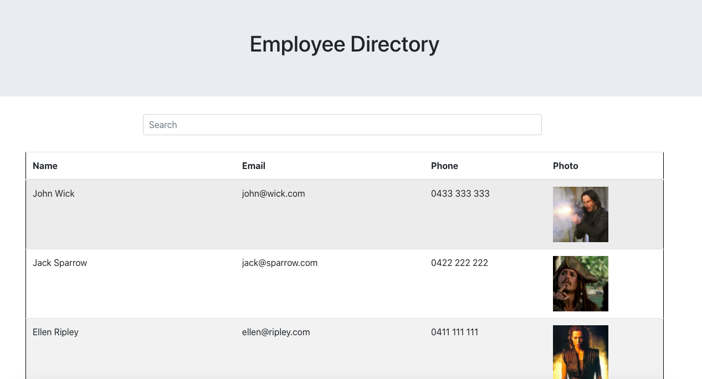

# Employee Directory

  

  ## Description
  
  This application is a employee directory that was create with react.

  ## Table of contents
  
  * [Installation](#installation)
  * [Usage](#usage)
  * [License](#license)
  * [Contributing](#contributing)
  * [Questions](#questions)
  

  ## Installation
  
 To install this application is necessary to run the command "npm install" and "npm start" on the terminal. Also, this application is deployed on github pages. To accesses, the application [click here](https://alvarofernandes.github.io/userDirectory/). 

  ## Usage

On this application you can sort the employees by "name" clicking on the name collunm, and also search for employees.

Screen shot of application:

  ## License

  This application uses MIT License

  ## Contributing

  ## Questions

  Any other question feel free to contact me on my email fernandes.alvaro@gmail.com or my git hub profile [Github profile](https://github.com/AlvaroFernandes).

